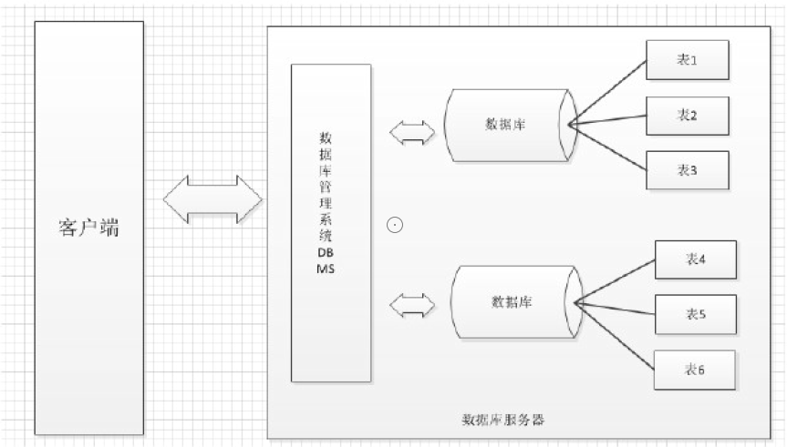
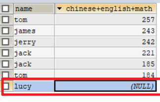
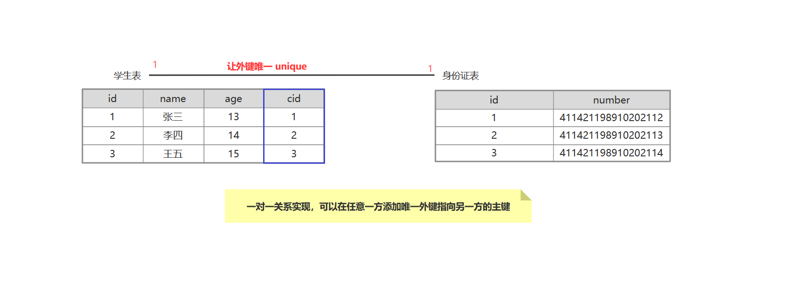
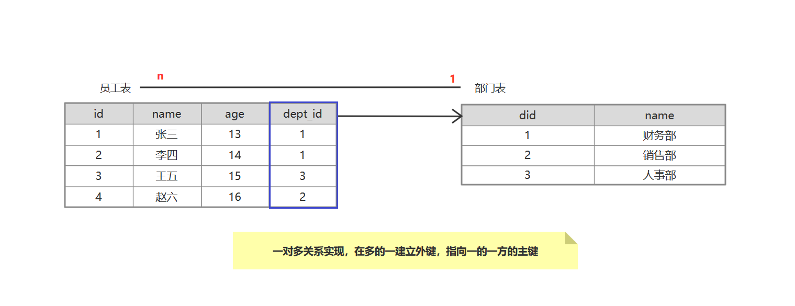
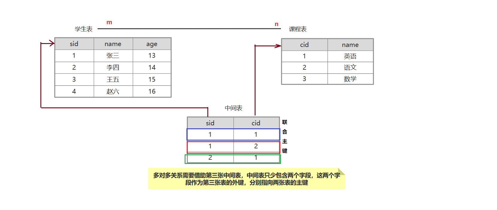
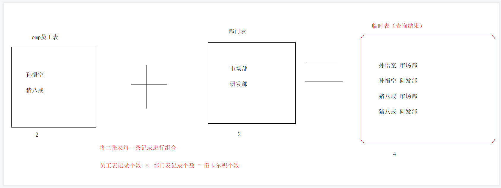
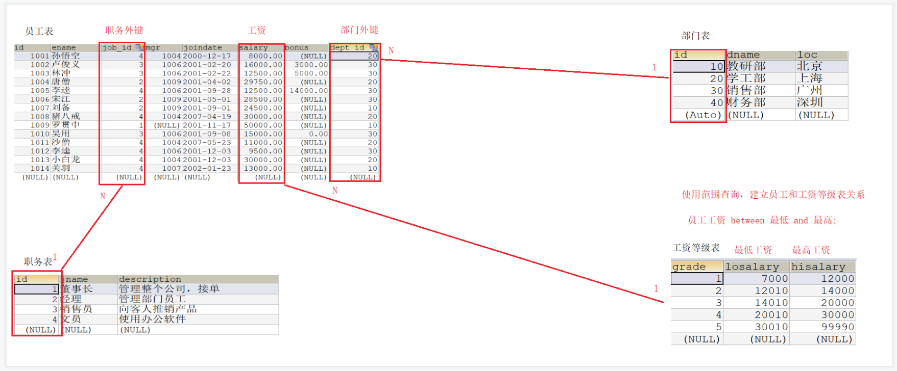
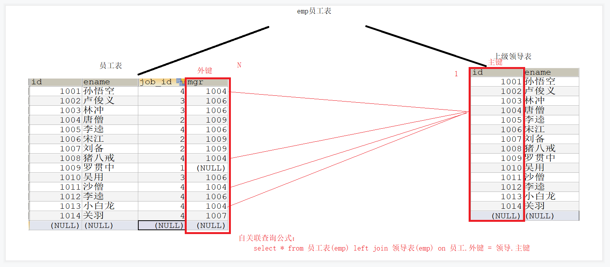

# 一、数据库概述

## 1.1 什么是数据库

​	数据库就是存储数据的仓库，其本质是一个文件系统，数据库按照特定的格式将数据存储起来，用户可以

对数据库中的数据进行增加，修改，删除及查询操作。

## 1.2  数据库管理系统

数据库管理系统（DataBase Managerment System, DBMS）: 指一种操作和管理数据库的大型软件，用于建立、使用和维护数据库，对数据库进行统一管理和控制，以保证数据库的安全性和完整性。用户通过数据库管理系统访问数据库中表内的数据


==数据库管理系统--->MySQL软件-->多个仓库--->多张表--->多条记录（数据）==





## 1.3 数据库的特点

```markdown
1. 持久化存储数据的。其实数据库就是一个文件系统
2. 方便存储和管理数据
3. 使用了统一的方式操作数据库
```

## 1.4 常见的数据库

| 关系型数据库              | 描述                                                         |
| :------------------------ | :----------------------------------------------------------- |
| MySQL                     | 开源免费的数据库,小型的数据库,已经被 Oracle 收购了。MySQL6.x 版本也开始收费。 |
| Oracle                    | 收费的大型数据库，Oracle 公司的产品                          |
| DB2                       | IBM 公司的数据库产品,收费的。常应用在银行系统中。            |
| SQL Server                | MicroSoft 公司收费的中型的数据库。C#、.net 等语言常使用。    |
| SQLite                    | 嵌入式的小型数据库，应用在手机端，如：Android。              |
| **非关系型数据库**(NoSQL) |                                                              |
| Redis                     | 基于内存的键值型数据库通过 Key-Value 键值的方式来存储数据    |
| MongoDB                   | MongoDB最流行的文档型数据库                                  |


# 二、SQL概述

## 2.1 什么是SQL

> 结构化查询语言(Structured Query Language)简称SQL,SQL语句就是对数据库进行操作的一种语言。
>
> SQL是一套标准，所有的数据库厂商都实现了此标准；但是各自厂商在此标准上增加了特有的语句，这部分内容我们称为`方言`。


## 2.2 SQL通用语法

```markdown
1. SQL 语句可以单行或多行书写，以分号结尾。
2. 可使用空格和缩进来增强语句的可读性。
3. MySQL 数据库的 SQL 语句不区分大小写，关键字建议使用大写。
	1). 库名 表名 字段 别名 建议写小写
	2). 关键字建议大写： SHOW DATABASES CREATE
4. 3 种注释
	* 单行注释: -- 注释内容 或 # 注释内容(mysql 特有) 
	* 多行注释: /* 注释 */
```


## 2.3 SQL语句的分类

| 分类                                              | 说明                                                         |
| ------------------------------------------------- | ------------------------------------------------------------ |
| DDL(Data Definition Language)数据定义语言         | 定义数据库对象:数据库,表,列等.关键字:create, drop,alter 等   |
| DML(Data Manipulation Language)数据操作语言(掌握) | 对数据库中表的数据进行增删改.关键字:insert, delete, update 等 |
| DQL(Data Query Language)数据查询语言 (掌握)       | 用来查询数据库中表的记录(数据).关键字:select, where 等       |
| DCL(Data Control Language)数据控制语言(了解)      | 用来定义数据库的访问权限和安全级别,及创建用户.关键字：GRANT,REVOKE 等 |
| TCL(Transaction Control Language) 事务控制语言    | 用于控制数据库的事务操作，关键字; commit,savepoint,rollback等 |


# 三、DDL语句

> 进入公司后，数据库和表只创建一次，通常有DBA数据库管理员操作 DataBase  Adminisitrator
>
> 后面我们学到图形化工具，可以简化这些操作，所以课下，只练一遍即可！

## 3.1  DDL操作数据库

* ##### ==创建数据库==

  ```sql
  create database 数据库名称;
  ```

* ##### ==创建数据库，并指定字符集==

  ```sql
  create database 数据库名称 character set utf8;
  ```

* ##### ==查询所有数据库的名称==

  ```sql
  show databases;
  ```

* ==查询某个数据库的字符集:查询某个数据库的创建语句==

  ```sql
  show create database 数据库名称;
  ```

* ==删除数据库==

  ```sql
  drop database 数据库名称;
  ```

* ==查询当前正在使用的数据库名称==

  ```sql
  select database();
  ```

* ##### ==使用数据库==

  ```sql
  use 数据库名称;
  ```


## 3.2 DDL操作表

> 表的CRUD操作：创建表，显示表，修改表，删除表操作

### 3.2.1 创建表

**语法：**

```sql
create table 表名(
    列名（字段名） 数据类型,
    列名（字段名） 数据类型,
    列名（字段名） 数据类型
    ...
);
```

**示例：**

```sql
create table student(
    id int,
    name varchar(32),
    birthday date		
);
```

**注意事项:** `最后一列，不需要加逗号（,）`


### 3.2.2 数据类型

| 数据类型  | 说明                                                         |
| --------- | ------------------------------------------------------------ |
| int       | 整数类型,例如 : age                                          |
| double    | 小数类型,例如 : score double(5,2)   111.11                   |
| date      | 日期，只包含年月日，yyyy-MM-dd                               |
| datetime  | 日期，包含年月日时分秒 yyyy-MM-dd HH:mm:ss                   |
| timestamp | 时间戳类型,包含年月日时分秒  yyyy-MM-dd HH:mm:ss 如果将来不给这个字段赋值，或赋值为null，则默认使用当前的系统时间，来自动赋值 |
| varchar   | 可变字符   name varchar(20)                                  |
| char      | 不可变字符  学号 char(10)                                    |

'abc'  = 'abc       '

### 3.2.3 查询表

* ##### ==查询某个数据库中所有的表名称==

  ```sql
  show tables;
  ```

* ##### ==查询表结构==

  ```sql
  desc 表名;
  ```

##### ==查询表中数据==

select  *  from  表名;

### 3.2.4 修改表

> 几乎不用，了解中的了解

* ##### ==添加一列==

  ```sql
  语法：
  	alter table 表名	add 列名 数据类型;
  实例：
  	alter table teacher add jieshao varchar(50);
  ```

* ==修改列类型==

  ```sql
  语法：
  	alter table 表名 modify 列名 新类型;
  实例：
  	alter table teacher modify jieshao varchar(99);
  ```

* ==修改列名和类型==

  ```sql
  语法：
  	alter table 表名 change 旧列名 新列名 新类型;
  实例：
  	alter table teacher change jieshao intro varchar(999);
  ```

* ==删除指定列==

  ```sql
  语法：
  	alter table 表名 drop 列名;
  实例：
  	alter table teacher drop intro;
  ```

* ==修改表字符集==

  ```sql
  语法：
  	alter table 表名 charset 字符集;
  实例：
  	alter table teacher charset gbk;
  ```

* ==修改表名==

  ```sql
  语法：
  	rename table 旧表名 to 新表名;
  实例：
  	rename table teacher to tch;
  ```


### 3.2.5 删除表

```sql
直接删除表
	语法：
		drop table 表名;
	实例：
		drop table tch;
```


# 四、DML语句 

## 4.1 添加数据

* ##### 语法

  ```sql
  insert into 表名(列名1,列名2,...列名n) values(值1,值2,...值n);	
  ```

* ##### 举例

  ```sql
  INSERT INTO student(`id`,`name`,`birthday`) VALUES (1,'李四1','2018-11-11');
  ```

* ##### 注意事项

  ==**列名和值要一一对应**==

    ```sql
  表名(列名1,列名2,...列名n)写了几个字段，我们就给几个值，值的类型要跟字段类型保持一致
    ```

  ==**如果表名后，不定义列名，则默认给所有列添加值【了解,不推荐使用】**==

  ```sql
  insert into 表名 values(值1,值2,...值n);
  ```

  ==**除了数字类型，其他类型需要使用引号(单双都可以)引起来**==

  ```sql
  【建议大家都使用单引号 '' 不要使用双引号】sql语句拼接   sql语句在java代码中是一个String
  ```

  ==**批量插入数据**==

  ```sql
  INSERT INTO stu1(`id`,`name`,`birthday`) VALUES
  (1,'李四1','2020-11-11'),
  (2,'李四2','2020-11-11'),
  (3,'李四3','2020-11-11'),
  (4,'李四4','2020-11-11');
  ```


## 4.2 删除数据

* ##### 语法

  ```sql
  delete from 表名 [where 条件]  
  ```

* ##### 举例

  ```sql
  delete from student where id = 1;
  ```

* ##### 注意事项

  ==**如果不加条件，则删除表中所有记录。**==

  ```sql
  delete from student; -- 删除所有的记录
  ```

  ==**如果要删除所有记录**==

  ```sql
  delete from 表名; 	 -- 不推荐使用。有多少条记录就会执行多少次删除操作
  TRUNCATE TABLE 表名;   -- 推荐使用，效率更高 先删除表，然后再创建一张一样的表
  ```


## 4.3 修改数据

* ##### 语法

  ```sql
  update 表名 set 列名1 = 值1, 列名2 = 值2,... [where 条件];
  ```

* ##### 举例

  ```sql
  update student set name = '王五', birthday = '2020-12-20' where id = 2;
  ```

* ##### 注意事项

  > 如果不加任何条件，则会将表中所有记录全部修改。


# 五、DQL语句

## 5.1 查询完整语法

```sql
select
	字段列表
from
	表名列表
where
	条件列表
group by
	分组字段
having
	分组之后的条件
order by
	排序
limit
	分页限定
```

## 5.2 select特点

```sql
* select 可以查询 表中的字段   表达式  常量值  函数
* 查询出的结果是一个虚拟表 不影响实际表中的数据
```


## 5.3 数据准备

```sql
-- 创建表
create table stu(
	id int,
	name varchar(20),
	chinese double,
	english double,
	math double
);
-- 插入记录
insert into stu(id,name,chinese,english,math) values(1,'tom',89,78,90);
insert into stu(id,name,chinese,english,math) values(2,'jack',67,98,56);
insert into stu(id,name,chinese,english,math) values(3,'jerry',87,78,77);
insert into stu(id,name,chinese,english,math) values(4,'lucy',88,NULL,90);
insert into stu(id,name,chinese,english,math) values(5,'james',82,84,77);
insert into stu(id,name,chinese,english,math) values(6,'jack',55,85,45);
insert into stu(id,name,chinese,english,math) values(7,'tom',89,65,30);
```


## 5.4 简单查询

* ==查询所有记录==

  ```sql
  语法:
  	SELECT * FROM 表名;
  举例:
  	SELECT * FROM stu;
  ```

* ==查询表中所有学生的姓名和对应的语文成绩==

  ```sql
  语法:
  	SELECT 字段名1，字段名2... FROM 表名;
  举例:
  	SELECT `name`,chinese FROM stu;
  ```

* ==查询表中学生姓名（去重）==

  ```sql
  语法:
  	select DISTINCT 字段名1，字段名2... FROM 表名;
  举例:
  	SELECT DISTINCT `name` FROM stu;
  	SELECT DISTINCT `name`,chinese FROM stu;
  ```

* ==在所有学生数学分数上加10分特长分==

  ```sql
  SELECT `name`,math+10 FROM stu;
  ```

* ==统计每个学生的总分==

  ```sql
  SELECT `name`, chinese+english+math FROM stu;
  ```

  发现`lucy`的总成绩为null，这是什么呢?

  


​	==在做行运算时,null参与的运算，计算结果都为null==

> 实际情况下，有一门学科没有成绩，是正常的，但是求总和的时候，不能将所有的学科的成绩，都是为null，显然这是不合理的，我们可以使用一个函数来解决这个问题!

```sql
ifnull(表达式1,表达式2)

	* 表达式1：哪个字段需要判断是否为null
	* 表达式2 :  如果该字段为null后的替换值。
```

```sql
SELECT `name`, chinese+IFNULL(english,0)+math FROM stu;
```


==总结==

```markdown
* 在做行运算时,null参与的运算，计算结果都为null  
* SELECT '123' + 100; -- 223 如果能转换成整数就跟后面的数值进行相加
* SELECT 'abc' + 100; -- 100 如果不能转换成整数 转换为0 在跟后面的数值进行相加
```


* ==起别名==

  > 在上面求每一个学生的总成绩时，展现出一个结果视图。在这个结果有两列，分别是name, chinese+IFNULL(english,0)+math 。第一个列名，一眼就能看出这列表示的是姓名，但是第二列，你能描述出这是一个学生的总成绩吗？ 显然不能。我们就要使用别名的方式，展示别名。

  ==语法==

  ```markdown
  as : as也可以省略
  ```

  ==在什么地方使用==

  ```markdown
  1. 可以用在某个字段上   name as 姓名
  2. 可以用在函数上      min(sarlay) as 最低工资
  3. 可以用在表上        from student as s
  
     注意事项: 如果给表起了别名,后面在使用的时候,必须要用别名
  ```

  ==例子==

   ```sql
  SELECT `name`, chinese+IFNULL(english,0) + math AS `总成绩` FROM stu;
  
  SELECT `name`, chinese+IFNULL(english,0) + math `总成绩` FROM stu;
   ```

  

​		 

## 5.5 条件查询

### 5.5.1 语法

> SELECT 字段名 FROM 表名 [WHERE 条件];

### 5.5.2  运算符

| 运算符                       | 说明                                                   |
| ---------------------------- | ------------------------------------------------------ |
| > 、< 、<= 、>= 、= 、<>  != | <>在 SQL 中表示不等于，在 mysql 中也可以使用!=  没有== |
| BETWEEN...AND                | 在一个范围之内                                         |
| IN( 集合)                    | 集合表示多个值，使用逗号分隔                           |
| IS NULL 不为空 is not null   | 查询某一列为 NULL 的值，注：不能写=NULL                |
| LIKE                         | 模糊查询   占位符: _:单个任意字符  %：多个任意字符     |
| AND  或 &&                   | 与，SQL 中建议使用前者，后者并不通用。                 |
| OR    或 \|\|                | 或                                                     |
| NOT  或  !                   | 非                                                     |

### 5.5.3 数据导入

```sql
-- 创建表
CREATE TABLE stu1 (
  id int,
  name varchar(20),
  age int,
  sex varchar(5),
  address varchar(100),
  math int,
  english int
);
-- 插入记录
INSERT INTO stu1(id,NAME,age,sex,address,math,english) VALUES 
(1,'马云',55,'男','杭州',66,78),
(2,'马化腾',45,'女','深圳',98,87),
(3,'马景涛',55,'男','香港',56,77),
(4,'柳岩',20,'女','湖南',76,65),
(5,'柳青',20,'男','湖南',86,NULL),
(6,'刘德华',57,'男','香港',99,99),
(7,'马德',22,'女','香港',99,99),
(8,'德玛西亚',18,'男','南京',56,65);
```


### 5.5.4 条件查询sql

* ==查询math分数大于80分的学生==

  > SELECT * FROM student2 WHERE math > 80;

* ==查询english分数小于或等于80分的学生==

  > SELECT * FROM student2 WHERE english <= 80;

* ==查询age等于20岁的学生==

  > SELECT * FROM student2 WHERE age = 20;

* ==查询age不等于20岁的学生==

  > SELECT * FROM student2 WHERE age != 20;

* ==查询age大于35且性别为男的学生(两个条件同时满足)==

  > SELECT * FROM student2 WHERE age > 35 AND sex = '男';

* ==查询age大于35或性别为男的学生(两个条件其中一个满足)==

  > SELECT * FROM student2 WHERE age > 35 OR sex = '男';

* ==查询id是1或3或5的学生==

  > SELECT * FROM student2 WHERE id = 1 OR id =3 OR id = 5;
  >
  > -- in关键字
  > -- 再次查询id是1或3或5的学生
  > SELECT * FROM student2 WHERE id IN(1,3,5);

* ==查询id不是1或3或5的学生==

  > SELECT * FROM student2 WHERE id NOT IN(1,3,5);

* ==查询english成绩大于等于77，且小于等于87的学生==

  > SELECT * FROM student2 WHERE english >=77 AND english <=87;
  >
  > SELECT * FROM student2 WHERE english BETWEEN 77 AND 87;

* ==查询英语成绩为null的学生==

  > SELECT * FROM student2 WHERE english = NULL; -- null这哥们六亲不认...
  > SELECT * FROM student2 WHERE english IS NULL;
  > SELECT * FROM student2 WHERE english IS NOT NULL;

* ==查询姓马的学生==

  > SELECT * FROM student2 WHERE name LIKE '马%';

* ==查询姓名中包含'德'字的学生==

  > SELECT * FROM student2 WHERE name LIKE '%德%';

* ==查询姓马，且姓名有三个字的学生==

  > SELECT * FROM student2 WHERE name LIKE '马__';


# 六、DQL高级查询

## 6.1 数据准备

```sql
-- 创建表
CREATE TABLE stu (
  id int,
  name varchar(20),
  age int,
  sex varchar(5),
  address varchar(100),
  math int,
  english int
);
-- 插入记录
INSERT INTO stu(id,NAME,age,sex,address,math,english) VALUES 
(1,'马云',55,'男','杭州',66,78),
(2,'马化腾',45,'女','深圳',98,87),
(3,'马景涛',55,'男','香港',56,77),
(4,'柳岩',20,'女','湖南',76,65),
(5,'柳青',20,'男','湖南',86,NULL),
(6,'刘德华',57,'男','香港',99,99),
(7,'马德',22,'女','香港',99,99),
(8,'德玛西亚',18,'男','南京',56,65),
(9,'唐僧',25,'男','长安',87,78),
(10,'孙悟空',18,'男','花果山',100,66),
(11,'猪八戒',22,'男','高老庄',58,78),
(12,'沙僧',50,'男','流沙河',77,88),
(13,'白骨精',22,'女','白虎岭',66,66),
(14,'蜘蛛精',23,'女','盘丝洞',88,88);
```


## 6.2 排序查询

### 6.2.1 语法

> SELECT 字段名 FROM 表名 [WHERE条件] ORDER BY 字段名 [ASC|DESC];

​			ASC: 升序，默认值

​			DESC: 降序

* ==注意事项==

  > 如果有多个排序条件，则当前边的条件值一样时，才会判断第二条件。

### 6.2.2 案例演示

* ==查询所有数据,使用年龄降序排序==

  > SELECT * FROM stu ORDER BY age DESC;

* ==查询所有数据,在年龄降序排序的基础上，如果年龄相同再以数学成绩降序排序==

  > SELECT * FROM stu ORDER BY age DESC,math DESC;

* ==计算math 和 english总成绩 并按照总成绩降序排序==

  > SELECT NAME , math + IFNULL(english,0)  score FROM stu ORDER BY score DESC; 


## 6.3 函数

### 6.3.1 什么是sql函数

当我们学习编程语言的时候，经常会遇到函数。函数的好处是，它可以把我们经常使用的代码封装起来，需要的时候直接调用即可。这样既提高了编写代码的效率，又提高了可维护性。在sql中函数主要要对数据进行处理！

### 6.3.2 常用的sql函数

```markdown
* 算术函数    （单行函数）
* 字符串函数   (单行函数） 
* 日期函数     (单行函数）
* 转换函数    （单行函数）
* 聚合函数
```


### 6.3.3 函数sql语法

```sql
SELECT 聚合函数(列名) FROM 表名;
```

### 6.3.4 常见聚合函数

| 聚合函数                  | 说明               |
| ------------------------- | ------------------ |
| count(\*\) \| count(主键) | 计算表中的总记录数 |
| max                       | 计算最大值         |
| min                       | 计算最小值         |
| sum                       | 计算和             |
| avg                       | 计算平均值         |

* **注意**：==聚合函数的计算，排除null值。==

* **解决方案**：			
  1. ==选择不包含非空的列进行计算==
  2. ==IFNULL函数==

### 6.3.5 聚合函数sql演示

* ==查询学生总数（null值处理）==

  ```sql
  SELECT COUNT(id) FROM stu;
  SELECT COUNT(english) FROM stu;
  SELECT COUNT(*) FROM stu;
  ```

* ==查询年龄大于40的总数==

  ```sql
  SELECT COUNT(*) FROM stu WHERE age >40;
  ```

* ==查询数学成绩总分==

  ```sql
  SELECT SUM(math) FROM stu;
  ```

* ==查询数学成绩平均分==

  ```sql
  SELECT AVG(math) FROM stu;
  ```

* ==查询数学成绩最高分==

  ```sql
  SELECT MAX(math) FROM stu;
  ```

* ==查询数学成绩最低分==

  ```sql
  SELECT MIN(math) FROM stu;
  ```

### 6.3.6单行函数

| 函数名                                                       | 说明     | 作用                                                         |
| ------------------------------------------------------------ | -------- | ------------------------------------------------------------ |
| length(str)                                                  | 字符函数 | 返回字符串s的字节数，和字符集有关                            |
| upper(str)                                                   | 字符函数 | 将字符转换为大写字符                                         |
| lower(str)                                                   | 字符函数 | 将字符转换为小写字符                                         |
| substring(str,pos)                                           | 字符函数 | 截取从指定索引处后面所有的字符                               |
| substring(str,pos,len)                                       | 字符函数 | 截取从pos索引开始截取len个字符                               |
| replace(str,from_str,to_str)                                 | 字符函数 | 将str中的字符 from_str字符替换成to_str字符                   |
| round(x)                                                     | 数学函数 | 四舍五入                                                     |
| round(x,d)                                                   | 数学函数 | 四舍五入  d:代表的是保留小数点后几位                         |
| ceil(x)                                                      | 数学函数 | 向上取整                                                     |
| floor(x)                                                     | 数学函数 | 向下取整                                                     |
| mod(n,m)                                                     | 数学函数 | 取余数   mod(10,3) 相当于: select 10 % 3                     |
| str_to_date(str,format)                                      | 日期函数 | 将日期字符转换成指定格式的日期 str_to_date('1990-11-11','%Y-%m-%d'); |
| date_format(date,format)                                     | 日期函数 | 将日期转换成字符  date_format(now(),'%Y/%m/%d');             |
| ifnull(值1,值2)                                              | 流程控制 | 如果值1不为null，则返回值1，否则返回值2                      |
| if(条件,值1,值2)                                             | 流程控制 | 如果条件为真，则返回值1，否则返回值2                         |
| case when 条件1 then 结果1<br /> when 条件2  then 结果2  <br />else  结果3   end | 流程控制 | 如果条件1为真，则执行结果1,如果条件2为真，则执行结果2，否则执行结果3 |

​          

## 6.4 分组查询

> 对一列数据进行分组，相同的内容分为一组，通常与聚合函数一起使用，完成统计工作

### 6.4.1 语法

```sql
SELECT 字段 1,字段 2... FROM 表名 [where条件] GROUP BY 分组字段 [HAVING 条件] [order by 字段];
```


* ==注意事项==
  * 分组之后查询的字段：分组字段、聚合函数
  * `where` 和 `having `的区别？
    * `where` 在分组之前进行限定，如果不满足条件，则不参与分组。having在分组之后进行限定，如果不满足结果，则不会被查询出来  where 对基本的条件筛选 
    * `where` 后不可以跟聚合函数，having可以进行聚合函数的判断。
  * `where:`  操作的数据源: 原始表
  * `having:`  操作的数据源: 结果集

### 6.4.2 案例演示

* ==查询男女各多少人==

  ```sql
  SELECT sex,max(*) FROM stu GROUP BY sex;
  ```

* ==查询年龄大于25岁的人,按性别分组,统计每组的人数==

  ```sql
  SELECT sex,COUNT(*) FROM stu WHERE age >25 GROUP BY sex;
  ```

* ==查询年龄大于25岁的人,按性别分组,统计每组的人数,并只显示性别人数大于2的数据==

  ```sql
  SELECT sex,COUNT(*) FROM stu WHERE age >25 GROUP BY sex HAVING COUNT(*)>2;
  ```

group by 使用注意事项：group by分组之后，select后边只能写分组字段、聚合函数、常量

## 6.5 分页查询

### 6.5.1 语法

```sql
SELECT *|字段列表 [as 别名] FROM 表名 [WHERE 子句] [GROUP BY 子句][HAVING 子句][ORDER BY 子句][LIMIT 子句];
```


### 6.5.2 LIMIT语法格式

```sql
LIMIT offset,length;
```

*  `offset：`起始行数，从 0 开始计数，如果省略，默认就是 0
*  `length：` 返回的行数

### 6.5.3 计算公式

> 开始的索引 = （当前的页码 - 1） * 每页显示的条数

```sql
-- 每页查询显示3条数据
SELECT * FROM stu LIMIT 0,3; -- 第1页
SELECT * FROM stu LIMIT 3,3; -- 第2页
SELECT * FROM stu LIMIT 6,3; -- 第3页
```


# 七、约束

## 7.1 什么是约束

> 对表中的数据进行限定，保证数据的正确性、有效性和完整性。	

## 7.2 约束的分类

| 约束        | 说明                          |
| :---------- | :---------------------------- |
| primary key | 主键约束:非空且唯一           |
| not null    | 非空约束 : 某一列的值不能为空 |
| unique      | 唯一约束 : 某一列的值不能重复 |
| foreign key | 外键约束                      |


## 7.3 主键约束

> 限定某一列的值非空且唯一， 主键就是表中记录的唯一标识。

### 7.3.1 创建表添加主键

```sql
create table stu3(
	id int primary key ,-- 给id添加主键约束
	name varchar(20)
);
```

```sql
CREATE TABLE stu3(
 id INT PRIMARY KEY,
 `name` VARCHAR(32)
);
```


* ==注意事项==

  ```markdown
  * 含义：非空且唯一
  * 一张表只能有一个主键约束，但是我们可以设置联合主键（多个字段）
  * 主键就是表中记录的唯一标识
  ```


### 7.3.2 创建完表后，添加主键

```sql
alter tabe 表名 add primary key(id);
```


### 7.3.3 创建完表后，删除主键

```sql
alter table 表名 drop primary key;
```

先移出自增器

```sql
alter table stu3 modify id int;
```

删除主键约束

```sql
alter table stu3 drop primary key;
```

> 因为只有主键约束才有意义设置自增器...（保证唯一性....）


### 7.3.4 自增器

> 一张表中主键是int类型，我们不用每次添加数据时，都要指定id，这样添加数据时，不能保证主键id的唯一性。 我们可以让主键id自动增加1。


* **创建表**

  ```sql
  create table 表名(
      id int priamry key auto_increment,
      ...
      ...
  );
  ```

  ```sql
  CREATE TABLE stu3(
    id INT PRIMARY KEY AUTO_INCREMENT,
    `name` VARCHAR(32)
  );
  ```

* **特点**

  > 自增器起始值为1，可以手动指定

  ```sql
  alter table 表名 auto_increment=起始值;
  ```


## 7.4 唯一约束

> 限定某一列的值不能重复，可以出现多个null

### 7.4.1 语法

```sql
create table 表名(
    列名 数据类型 unique,
    ...
    ...
);
```


### 7.4.2 案例演示

```sql
CREATE TABLE stu4(
  id INT PRIMARY KEY AUTO_INCREMENT,
  `name` VARCHAR(32) UNIQUE 
);

INSERT INTO stu4 VALUES(1,'jack');
-- Duplicate entry 'jack' for key 'name' 错误：名称重复了
INSERT INTO stu4 VALUES(2,'jack');
INSERT INTO stu4 VALUES(3,NULL);
INSERT INTO stu4 VALUES(4,NULL);
```


## 7.5 非空约束

> 限定某一列的值不能为null


### 7.5.1 语法

```sql
create table 表名(
    列名 数据类型 not null,-- 非空约束
    列名 数据类型 unique not null,-- （唯一+非空）
);
```


### 7.5.2 案例演示

```sql
-- 唯一+非空
CREATE TABLE stu5(
 id INT PRIMARY KEY AUTO_INCREMENT,
 `name` VARCHAR(32) UNIQUE NOT NULL
);

INSERT INTO stu5 VALUES(1,'jack');
-- Column 'name' cannot be null 错误：名称不能为空
INSERT INTO stu5 VALUES(2,NULL);
```

==注意事项==

```markdown
问题：唯一 + 非空 = 主键？？
不等于，主键约束一张表只能有一个，唯一+非空 设置多个
```


## 7.6 外键约束

> 限定二张表有关系的数据，保证数据的正确性、有效性和完整性


### 7.6.1 语法

```sql
create table 表名(
  	列名 数据类型,
  	[constraint] [约束名] foreign key(外键列) references 主表(主键)
);	
```

### 7.6.2 外键约束特点

```markdown
1） 主表不能删除从表已引用的数据
2） 从表不能添加主表未拥有的数据
3） 先添加主表数据再添加从表数据
4） 先删除从表数据再删除主表数据
5） 外键约束允许为空但不能是错的
```

### 7.6.3 已有表添加外键

```sql
alter table 表名 add [constraint] [约束名] foreign key(外键列) references 主表(主键);
```

### 7.6.4 删除外键约束

```sql
alter table 表名 drop foreign key 约束名;
```


### 7.6.5 案例演示

```sql
-- 创建部门表(id,dep_name,dep_location)
-- 一方，主表
CREATE TABLE department(
	id INT PRIMARY KEY AUTO_INCREMENT,
	dep_name VARCHAR(20),
	dep_location VARCHAR(20)
);


-- 创建员工表(id,name,age,dep_id)
-- 多方，从表
CREATE TABLE employee(
	id INT PRIMARY KEY AUTO_INCREMENT,
	NAME VARCHAR(20),
	age INT,
	dep_id INT, -- 外键对应主表的主键
	-- CONSTRAINT dept_emp_fk_id  可以省略不写
	CONSTRAINT dept_emp_fk_id FOREIGN  KEY (dep_id) REFERENCES department (id)
	 
);


-- 添加 2 个部门
INSERT INTO department VALUES(NULL, '研发部','广州'),(NULL, '销售部', '深圳');
SELECT * FROM department;
-- 添加员工,dep_id 表示员工所在的部门
INSERT INTO employee (NAME, age, dep_id) VALUES ('张三', 20, 1);
INSERT INTO employee (NAME, age, dep_id) VALUES ('李四', 21, 1);
INSERT INTO employee (NAME, age, dep_id) VALUES ('王五', 20, 1);
INSERT INTO employee (NAME, age, dep_id) VALUES ('老王', 20, 2);
INSERT INTO employee (NAME, age, dep_id) VALUES ('大王', 22, 2);
INSERT INTO employee (NAME, age, dep_id) VALUES ('小王', 18, 2);
SELECT * FROM employee;
```

## 7.7 默认值

> 限定某一列的默认值，再没有指定的情况下所有列的默认值为null

### 7.7.1 语法

```sql
create table 表名(
    列名 数据类型 default 默认值,
    ...
    ...
);
```


### 7.7.2 案例演示

```sql
-- 默认值
CREATE TABLE stu5(
   id INT PRIMARY KEY AUTO_INCREMENT,
  `name` VARCHAR(32),
   sex VARCHAR(5) DEFAULT '男'
);
INSERT INTO stu5(id,`name`) VALUES(1,'小张');
INSERT INTO stu5(id,`name`,sex) VALUES(2,'小刘','女');
-- 因为我们指定了默认值为男，你再插入null，会把默认值覆盖...
INSERT INTO stu5 VALUES(3,'小王',NULL);
```


# 八、表关系

> 现实生活中，（班级）实体与（学生）实体之间肯定是有关系的，那么我们在设计表的时候，就应该体现出（班级）表与（学生）表之间的这种关系！
>
> ==简称：关系型数据库（Relation DBMS）==


## 8.1 常见的表关系

* ==一对一==

  > 公民和身份证号、公司和注册地
  >
  > 一个公民只能有一个身份证号，一个身份证号对应一个公民

* ==一对多==

  > 班级和学生、部门和员工
  >
  > 一个班级下面有多名同学，多名同学属于某一个班级

* ==多对多==

  > 老师和学生、学生和课程
  >
  > 一名老师可以教导多名学生，一名学生可以被多个老师教导


## 8.2 一对一

> 一对一关系在实际开发中用的并不多，因为可以把关联字段设计在同一张表...



## 8.3 一对多(多对一)



## 8.4 多对多



## 8.5 多表关系案例

* ##### ==创建旅游线路分类表 tab_category==

  ```sql
  -- 创建旅游线路分类表 tab_category
  -- cid 旅游线路分类主键，自动增长
  -- cname 旅游线路分类名称非空，唯一，字符串 100
  CREATE TABLE tab_category (
      cid INT PRIMARY KEY AUTO_INCREMENT,
      cname VARCHAR(100) NOT NULL UNIQUE
  );
  ```

* ##### ==创建旅游线路表 tab_route==

  ```sql
  -- rid 旅游线路主键，自动增长
  -- rname 旅游线路名称非空，唯一，字符串 100
  -- price 价格
  -- rdate 上架时间，日期类型
  -- cid 外键，所属分类
  CREATE TABLE tab_route(
      rid INT PRIMARY KEY AUTO_INCREMENT,
      rname VARCHAR(100) NOT NULL UNIQUE,
      price DOUBLE,
      rdate DATE,
      cid INT,
      FOREIGN KEY (cid) REFERENCES tab_category(cid)
  );  
  ```

* ##### ==创建用户表 tab_user==

  ```sql
  -- uid 用户主键，自增长
  -- username 用户名长度 100，唯一，非空
  -- password 密码长度 30，非空
  -- name 真实姓名长度 100
  -- birthday 生日
  -- sex 性别，定长字符串 1
  -- telephone 手机号，字符串 11
  -- email 邮箱，字符串长度 100
  
  CREATE TABLE tab_user (
      uid INT PRIMARY KEY AUTO_INCREMENT,
      username VARCHAR(100) UNIQUE NOT NULL,
      PASSWORD VARCHAR(30) NOT NULL,
      NAME VARCHAR(100),
      birthday DATE,
      sex CHAR(1) DEFAULT '男',
      telephone VARCHAR(11),
      email VARCHAR(100)
  );
  ```

* ##### ==收藏表 tab_favorite==

  ```sql
  -- rid 旅游线路 id，外键
  -- date 收藏时间
  -- uid 用户 id，外键
  -- rid 和 uid 不能重复，设置复合主键，同一个用户不能收藏同一个线路两次
  
  CREATE TABLE tab_favorite (
      rid INT, -- 线路id
      DATE DATETIME,
      uid INT, -- 用户id
      -- 创建复合主键
      PRIMARY KEY(rid,uid), -- 联合主键
      FOREIGN KEY (rid) REFERENCES tab_route(rid),
      FOREIGN KEY(uid) REFERENCES tab_user(uid)
  );
  ```

* ##### ==总结==

  >一个用户可以收藏多条线路  , 线路也可以被多个用户所收藏    用户与收藏线路表: 多对多的关系,必须建立中间表
  >
  >线路分类中可以有多条线路  线路分类表 和 收藏表  一对多的关系


# 九、多表查询

## 9.1 多表查询概述

> 同时查询多张表获取到需要的数据组成完整的信息返回给用户。


## 9.2 多表查询语法

```sql
select
	字段列表
from
	表名列表
where
	条件列表
group by
	分组字段
having
	分组之后的条件
order by
	排序
limit
	分页限定
```


## 9.3 数据准备

```sql
-- 多表查询
create database db3;
use db3;
-- 创建部门表（主表）
CREATE TABLE dept (
  id INT PRIMARY KEY AUTO_INCREMENT,
  NAME VARCHAR(20)
);

INSERT INTO dept (NAME) VALUES ('开发部'),('市场部'),('财务部'),('销售部');

-- 创建员工表（从表）
CREATE TABLE emp (
  id INT PRIMARY KEY AUTO_INCREMENT,
  NAME VARCHAR(10),
  gender CHAR(1),   -- 性别（sex）
  salary DOUBLE,   -- 工资
  join_date DATE,  -- 入职日期
  dept_id INT -- 外键字段
);

INSERT INTO emp(NAME,gender,salary,join_date,dept_id) VALUES('孙悟空','男',7200,'2013-02-24',1);
INSERT INTO emp(NAME,gender,salary,join_date,dept_id) VALUES('猪八戒','男',3600,'2010-12-02',2);
INSERT INTO emp(NAME,gender,salary,join_date,dept_id) VALUES('唐僧','男',9000,'2008-08-08',2);
INSERT INTO emp(NAME,gender,salary,join_date,dept_id) VALUES('白骨精','女',5000,'2015-10-07',3);
INSERT INTO emp(NAME,gender,salary,join_date,dept_id) VALUES('蜘蛛精','女',4500,'2011-03-14',1);
INSERT INTO emp(NAME,gender,salary,join_date,dept_id) VALUES('沙僧','男',6666,'2017-03-04',null);
```


## 9.4 多表查询分类

### 9.4.1 笛卡尔积

> 多张表的记录进行组合，这种现象称为笛卡尔积(交叉连接)



* ##### ==语法==

  ```sql
  select ... from 左表,右表;
  ```

* ##### ==sql演示==

  ```sql
  -- 查询二张表
  SELECT * FROM emp,dept;
  SELECT COUNT(*) FROM emp,dept;
  ```


### 9.4.2 内连接

> 拿左表的记录去匹配右表的记录，若符合条件显示（二张表的交集）

* ##### ==语法==

  ```sql
  -- 隐式内连接
  select ... from 左表,右表 where 连接条件;
  ```

  ```sql
  -- 显示内连接【推荐】
  select ... from 左表 [inner] join 右表 on 连接条件;
  ```

* ##### ==sql演示==

  ```sql
  -- 隐式内连接
  SELECT * FROM emp e,dept d WHERE e.dept_id = d.id;
  
  -- 显示内连接
  SELECT * FROM emp e INNER JOIN dept d ON e.dept_id = d.id;
  ```

* ##### ==案例==

  查询唐僧的 id，姓名，性别，工资和所在部门名称

  ```sql
  -- 1.确定查询表
  SELECT * FROM emp e INNER JOIN dept d;
  -- 2.确定连接条件
  SELECT * FROM emp e INNER JOIN dept d ON e.dept_id = d.id;
  -- 3.确定显示字段
  SELECT e.id,e.name,e.gender,e.salary,d.name FROM emp e INNER JOIN dept d ON e.dept_id = d.id;
  -- 4.确定业务条件
  SELECT e.id,e.name,e.gender,e.salary,d.name FROM emp e INNER JOIN dept d ON e.dept_id = d.id WHERE e.name = '唐僧';
  ```


### 9.4.3 外连接

* ##### ==左外连接==

  > 展示左表全部，再去匹配右表记录，若条件符合显示，若条件不符合显示NULL

  语法

  ```sql
  select ... from 左表 left [outer] join 右表 on 连接条件;
  ```

* ##### ==右外连接==

  > 展示右表全部，再去匹配左表记录，若条件符合显示，若条件不符合显示NULL

  语法

  ```sql
  select ...from 左表 right [outer] join 右表 on 连接条件;
  ```

* ##### ==sql演示==

  ```sql
  # 左外连接（推荐）
  -- 查询所有员工信息及对应的部门名称
  SELECT * FROM emp e LEFT OUTER JOIN dept d ON e.dept_id = d.id;
  -- 查询所有部门及对应的员工信息
  SELECT * FROM dept d LEFT JOIN emp e ON e.dept_id = d.id;
  
  # 右外连接（了解）
  -- 查询所有部门及对应的员工信息
  SELECT * FROM emp e RIGHT OUTER JOIN dept d ON e.dept_id = d.id;
  ```


### 9.4.4 子查询

> 一条select语句执行结果，作为另一条select语法的一部分。其实就是select语句的嵌套！

* ##### ==语法==

  ```sql
  -- 【1】查询结果单值
  SELECT MAX(salary) FROM emp;
  -- 【2】查询结果单列多行
  SELECT salary FROM emp;
  -- 【3】查询结果多行多列
  SELECT * FROM emp;
  ```

  **规律**

  ```sql
  -- 【1】子查询结果为单列，肯定作为条件在where后面使用
  		select ... from 表名 where 字段 in (子查询);
  -- 【2】子查询结果为多列，一般作为虚拟表在from后面使用
  		select ... from (子查询) as 表别名;
  ```

* ##### ==sql演示==

  * ###### 子查询结果为单行单列

    ```sql
    -- 【1】查询工资最高的员工是谁？ 
    SELECT * FROM emp WHERE salary = (SELECT MAX(salary) FROM emp);
    ```

    ```sql
    -- 【2】查询工资小于平均工资的员工有哪些？
    -- 2.1 先求出平均工资
    SELECT AVG(salary) FROM emp;
    -- 2.2 查询低于平均工资的员工
    SELECT * FROM emp WHERE salary < (SELECT AVG(salary) FROM emp);
    ```

  * ###### 子查询结果为单列多行

    ```sql
    -- 【1】查询工资大于5000的员工，来自于哪些部门的名字  
    -- 1.1 查询工资大于5000的员工
    SELECT dept_id FROM emp WHERE salary >5000;
    -- 1.2 来自于哪些部门的名字  
    SELECT * FROM dept WHERE id IN(SELECT dept_id FROM emp WHERE salary >5000);
    ```

    ```sql
    -- 【2】查询开发部与财务部所有的员工信息
    -- 2.1 根据部门名称，查询部门主键
    SELECT id FROM dept WHERE `name` IN('开发部','财务部');
    -- 2.2 根据部门id查询员工信息
    SELECT * FROM emp WHERE dept_id IN (SELECT id FROM dept WHERE `name` IN('开发部','财务部'));
    
    ```

  * ###### 子查询结果为多列多行

    ```sql
    -- 【1】 查询员工入职日期是2011-11-11日之后的员工信息和部门信息
    -- 1.1 根据 join_date 查询 2011-11-11 之后的员工信息
    SELECT * FROM emp WHERE emp.`join_date` > '2011-11-11';
    
    -- 1.2 根据1步骤的结果，跟部门表关联
    SELECT * FROM dept t1 ,(SELECT * FROM emp WHERE emp.`join_date` > '2011-11-11') t2 WHERE t1.id = t2.dept_id;
    ```


# 十、多表查询综合案例

## 10.1  数据准备

```sql
-- 多表案例
create database db3_pro;
use db3_pro;
-- 部门表
CREATE TABLE dept (
  id INT PRIMARY KEY auto_increment, -- 部门id
  dname VARCHAR(50), -- 部门名称
  loc VARCHAR(50) -- 部门位置
);

-- 添加4个部门
INSERT INTO dept(id,dname,loc) VALUES 
(10,'教研部','北京'),
(20,'学工部','上海'),
(30,'销售部','广州'),
(40,'财务部','深圳');

-- 职务表
CREATE TABLE job (
  id INT PRIMARY KEY,
  jname VARCHAR(20), -- 职务名称
  description VARCHAR(50) -- 职务描述
);

-- 添加4个职务
INSERT INTO job (id, jname, description) VALUES
(1, '董事长', '管理整个公司，接单'),
(2, '经理', '管理部门员工'),
(3, '销售员', '向客人推销产品'),
(4, '文员', '使用办公软件');

-- 员工表
CREATE TABLE emp (
  id INT PRIMARY KEY, -- 员工id
  ename VARCHAR(50), -- 员工姓名
  job_id INT, -- 职务id  外键
  mgr INT , -- 上级领导
  joindate DATE, -- 入职日期
  salary DECIMAL(7,2), -- 工资 99999.99
  bonus DECIMAL(7,2), -- 奖金 99999.99
  dept_id INT, -- 所在部门编号  外键
  CONSTRAINT emp_jobid_ref_job_id_fk FOREIGN KEY (job_id) REFERENCES job (id),
  CONSTRAINT emp_deptid_ref_dept_id_fk FOREIGN KEY (dept_id) REFERENCES dept (id)
);

-- 添加员工
INSERT INTO emp(id,ename,job_id,mgr,joindate,salary,bonus,dept_id) VALUES 
(1001,'孙悟空',4,1004,'2000-12-17','8000.00',NULL,20),
(1002,'卢俊义',3,1006,'2001-02-20','16000.00','3000.00',30),
(1003,'林冲',3,1006,'2001-02-22','12500.00','5000.00',30),
(1004,'唐僧',2,1009,'2001-04-02','29750.00',NULL,20),
(1005,'李逵',4,1006,'2001-09-28','12500.00','14000.00',30),
(1006,'宋江',2,1009,'2001-05-01','28500.00',NULL,30),
(1007,'刘备',2,1009,'2001-09-01','24500.00',NULL,10),
(1008,'猪八戒',4,1004,'2007-04-19','30000.00',NULL,20),
(1009,'罗贯中',1,NULL,'2001-11-17','50000.00',NULL,10),
(1010,'吴用',3,1006,'2001-09-08','15000.00','0.00',30),
(1011,'沙僧',4,1004,'2007-05-23','11000.00',NULL,20),
(1012,'李逵',4,1006,'2001-12-03','9500.00',NULL,30),
(1013,'小白龙',4,1004,'2001-12-03','30000.00',NULL,20),
(1014,'关羽',4,1007,'2002-01-23','13000.00',NULL,10);

-- 工资等级表
CREATE TABLE salarygrade (
  grade INT PRIMARY KEY,  -- 等级
  losalary INT, -- 最低工资
  hisalary INT -- 最高工资
);

-- 添加5个工资等级
INSERT INTO salarygrade(grade,losalary,hisalary) VALUES 
(1,7000,12000),
(2,12010,14000),
(3,14010,20000),
(4,20010,30000),
(5,30010,99990);
```


## 10.2 表之间的关系




## 10.3 案例一

> ==查询所有员工信息。显示员工编号，员工姓名，工资，职务名称，职务描述==

   ```sql
/*
	1.员工编号，员工姓名，工资，需要查询emp表  职务名称，职务描述 需要查询job表
	2.查询条件 emp.job_id = job.id
*/
 SELECT 
 	t1.`id`, -- 员工编号
 	t1.`ename`, -- 员工姓名
 	t1.`salary`,-- 工资
 	t2.`jname`, -- 职务名称
 	t2.`description` -- 职务描述
 FROM 
 	emp t1, job t2
 WHERE 
 	t1.`job_id` = t2.`id`;
   ```


## 10.4 案例二

> ==查询所有员工信息。显示员工编号，员工姓名，工资，职务名称，职务描述，部门名称，部门位置==

```sql
/*
    1. 员工编号，员工姓名，工资 emp  职务名称，职务描述 job  部门名称，部门位置 dept
    2. 条件： emp.job_id = job.id and emp.dept_id = dept.id
*/
SELECT 
	t1.`id`, -- 员工编号
	t1.`ename`, -- 员工姓名
	t1.`salary`,-- 工资
	t2.`jname`, -- 职务名称
	t2.`description`, -- 职务描述
	t3.`dname`, -- 部门名称
	t3.`loc` -- 部门位置
FROM 
	emp t1, job t2,dept t3
WHERE 
	t1.`job_id` = t2.`id` AND t1.`dept_id` = t3.`id`;
```

## 10.5 案例三

> ==查询员工姓名，工资，工资等级==

```sql
/*
    1.员工姓名，工资 emp  工资等级 salarygrade
    2.条件 emp.salary >= salarygrade.losalary and emp.salary <= salarygrade.hisalary
          emp.salary BETWEEN salarygrade.losalary and salarygrade.hisalary
*/

SELECT 
	t1.`ename` ,
	t1.`salary`,
	t2.*
FROM 
	emp t1, 
	salarygrade t2
WHERE 
	t1.`salary` BETWEEN t2.`losalary` AND t2.`hisalary`;
```

## 10.6 案例四

> ==查询员工姓名，工资，职务名称，职务描述，部门名称，部门位置，工资等级==

```sql
/*
    1. 员工姓名，工资 emp ， 职务名称，职务描述 job 部门名称，部门位置，dept 工资等级 salarygrade
    2. 条件： emp.job_id = job.id and emp.dept_id = dept.id and emp.salary between salarygrade.losalary 			  and salarygrade.hisalary
*/

SELECT 
    t1.`ename`,
    t1.`salary`,
    t2.`jname`,
    t2.`description`,
    t3.`dname`,
    t3.`loc`,
    t4.`grade`
FROM 
	emp t1,job t2,dept t3,salarygrade t4
WHERE 
	t1.`job_id` = t2.`id` AND 
	t1.`dept_id` = t3.`id` AND 
	t1.`salary` BETWEEN t4.`losalary` AND t4.`hisalary`;
```


## 10.7 案例五

> ==查询出部门编号、部门名称、部门位置、部门人数==

```sql
/*
    1.部门编号、部门名称、部门位置 dept 表。 部门人数 emp表
    2.使用分组查询。按照emp.dept_id完成分组，查询count(id)
    3.使用子查询将第2步的查询结果和dept表进行关联查询
*/
SELECT 
	t1.`id`,
	t1.`dname`,
	t1.`loc` , 
	t2.total
FROM 
	dept t1,
    (
        SELECT
        	dept_id,COUNT(id) total
        FROM 
            emp
        GROUP BY dept_id
    ) t2
WHERE t1.`id` = t2.dept_id;
```

## 10.8 案例六



> ==查询每个员工的名称及其上级领导的名称（自关联）==

```sql
/*
	1.姓名 emp， 直接上级的姓名 emp
	 emp表的id 和 mgr 是自关联
    2.条件 emp.id = emp.mgr
    3.查询左表的所有数据，和 交集数据
         使用左外连接查询
*/
SELECT 
  yuangong.id,
  yuangong.ename,
  lingdao.id,
  lingdao.ename 
FROM
  emp yuangong 
LEFT OUTER JOIN 
  emp lingdao 
ON yuangong.mgr = lingdao.id ;
```


## 10.9 总结

​	我们在企业开发时，根据不同的业务需求往往需要通过2张及以上的表中去查询需要的数据。其实不管是几张表的查询，都是有规律可循的。 

```markdown
* 多表查询会产生笛卡尔积

* 消除笛卡尔积
		连接条件 = 表个数-1
		
* 步骤
		1）确定几张表
		2）确定连接条件
		3）确定显示字段
		4）确定业务条件
```

